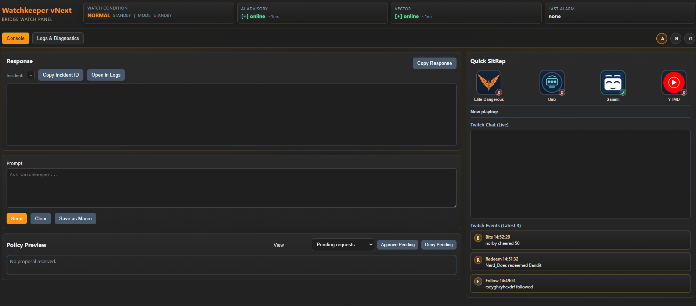

# Watchkeeper vNext

Watchkeeper is a local-first "ship AI" for **Elite Dangerous** and streaming ops: it ingests live game + system signals, reasons over them with an LLM, and can trigger tools/actions (OBS/SAMMI/lighting/automation) in a way that is **deterministic, auditable, and safe**.

**Why this exists:** modern PC + stream + game setups are a spaghetti monster of windows, macros, overlays, and "why is nothing responding?" Watchkeeper is an attempt to turn that chaos into a system: **sensors -> state -> policy -> decisions -> actions**, with a UI that tells you what it is doing and why.

---

## The story so far

Watchkeeper did not start as a clean architecture project. It started as a practical survival stack: scripts, adapters, and glue code built to keep a live game + stream environment stable under pressure.

The early prototype proved the hard part first: local models could run on constrained hardware, game/system/music signals could be ingested, and real automation could be triggered in-session.

That prototype also exposed the real pain:

- duplicated state
- unclear ownership between services
- fragile integrations when dependencies dropped
- too much "it works, but why does it work?"

vNext is the response to those lessons. Same mission, higher engineering bar.

## Why vNext is different

Watchkeeper vNext is opinionated:

- AI proposes, core decides
- policy gates before action
- every important decision is traceable
- dependency loss should degrade behavior, not collapse it

If the internet is down, or a local model fails, or an external tool disappears, the system should still behave like a disciplined bridge crew, not a random macro chain.

---

## What we're aiming for

A modular, local-first assistant that can:

- **Understand context** (game state, UI focus, ship status, events, chat/redeems/bits, system health)
- **Decide safely** (policy gating, confirmations where needed, rate-limits, dependency awareness)
- **Act reliably** (tool calls for streaming, automation, and "ship" functions)
- **Explain itself** (traceable events, deterministic state transitions, operator-friendly UI)
- **Stay resilient** (continues functioning when dependencies go down; degrades gracefully)

This is not "an AI that does whatever it wants." It is closer to a well-behaved bridge officer: helpful, cautious, and accountable.

---

## Where we are now

vNext is the architecture reset: a cleaner spine, better boundaries, stronger operational discipline.

### Core spine: Brainstem + contracts + runtime discipline

- Clear separation between ingestion, state, policy, and tool execution
- Contract-driven API surface (stable JSON shapes over ad-hoc internal structures)
- Deterministic runtime patterns (no mystery background loops)

### Twitch/SAMMI integration checkpoint (recent milestone)

- **Two-way comms between SAMMI and Watchkeeper**
- UDP "doorbell" event notification: `category|timestamp`
- Twitch ingest is **hard-gated** by SAMMI runtime state (`app.sammi.running`)
  - Listener binds only when SAMMI is running
  - Clean unbind/close when SAMMI drops
  - Automatic rebind when SAMMI returns
- UI polish pass for the bridge panel workflow and visual consistency

In short: the "nervous system" is working and stable. Next is filling the database with real, useful memory.

## UI Snapshot

---

## What we've done (high-level)

- Built the vNext foundation around a **deterministic core**
- Implemented early **operator console/UI** for visibility and control
- Proved **SAMMI <-> Watchkeeper** messaging is reliable enough for production use
- Added safety gates so external dependencies do not cause runaway background work
- Moved key behavior into documented contracts so future rewrites are ports, not redesigns

---

## Where we're going next

### 1) Twitch user modelling + SQLite persistence

We want Watchkeeper to recognize people and patterns without hoarding data.

- One entry per user (Twitch user_id as primary key)
- Store **last 5 chat messages** for short-term context
- Track roles and signals: VIP/mod/broadcaster/subscriber
- Track aggregates: bits totals, redeems claimed, hype activity
- "Usual behaviour" prompts (e.g. "Want the usual redeem?") with policy limits

### 2) Twitch policy framework (what we do / ask / don't)

A rules layer that makes behaviour consistent and non-annoying:

- What we do: contextual replies, lightweight personalization, good operator hygiene
- What we ask: confirmation before spammy/disruptive actions
- What we do not: store full chat logs, infer sensitive traits, pester users relentlessly

### 3) Endpoints + UI expansion

Once the base is solid:

- Add a **Twitch frame** in the UI (live events, user card, stats, policy decisions)
- Expose clean endpoints for user context and recent events
- Add operator tooling for debugging ("why did it say that?")

---

## Design principles

- **Local-first**: work offline, degrade gracefully, minimal cloud dependence
- **Deterministic by default**: predictable loops, explicit state, no hidden magic
- **Policy before action**: anything potentially disruptive gets gated
- **Human operable**: UI and logs make it obvious what is happening
- **Small, composable services**: each subsystem does one job well
- **Build for handover**: another engineer should be able to understand "what happened and why" quickly

---

## Repository map (conceptual)

- `services/brainstem/` - the core state + policy + tool orchestration layer
- `contracts/` - API contracts and payload shapes
- `docs/` - architecture, operations, policy notes
- `ui/` - operator console / bridge panel
- `db/` - persistence utilities and schema/migrations

(Exact paths may evolve as vNext matures.)

---

## Status

Current status: **Usable (developer alpha)**.

Working now:

- Brainstem runtime, policy gate, and event/state pipeline
- ED/music/system ingestion loops
- SAMMI <-> Watchkeeper Twitch bridge with gating and dedupe
- Web UI for operator workflows, diagnostics, and policy previews

Next short-form steps:

- deepen Twitch user memory and behavior modelling
- expand policy-guided chat/redeem response quality
- continue hardening recovery paths and degraded-mode behavior

---

## Contributing / dev notes

This is a "build the bridge while flying the ship" repo. If you are contributing:

- keep changes scoped
- update docs/contracts when you add behaviour
- prefer deterministic state transitions to clever hacks
- never add background loops without explicit gating and lifecycle management

---

## License

TBD (add license once the architecture settles and we are happy with the public surface).
