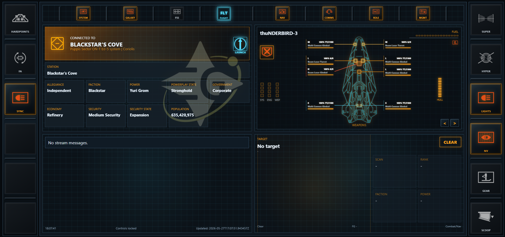
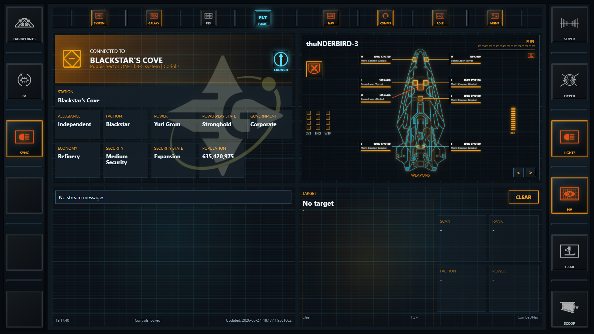
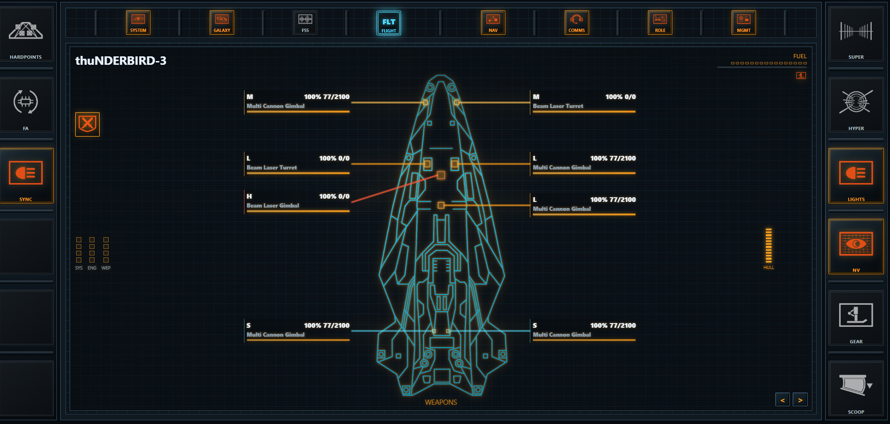
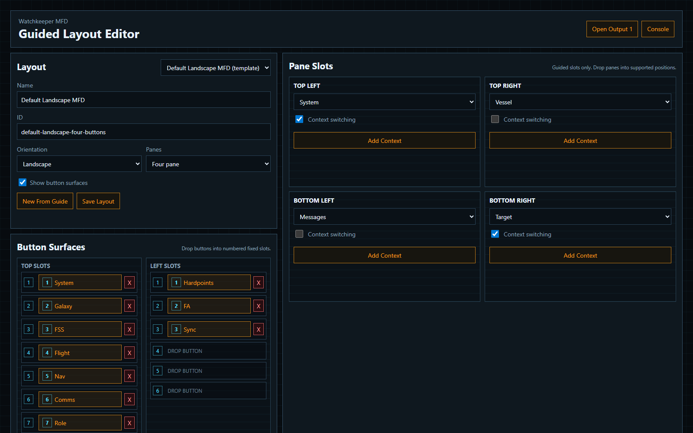
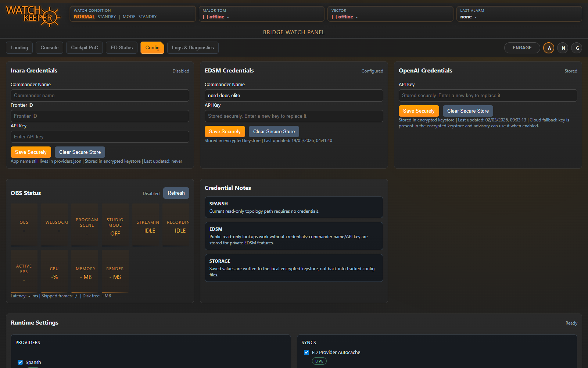

# WATCHKEEPER vNEXT

**Your ship already produces the data. Watchkeeper turns it into command presence.**

Watchkeeper is a real-time cockpit and immersion platform for **Elite Dangerous**: adaptive MFDs, live telemetry, command panels, touch displays, lighting hooks, streaming support and external data bridges, all built around the idea that your ship should feel like a live operational system.

This is not an autopilot.

This is not automation playing the game for you.

This is the bridge computer Elite Dangerous keeps hinting at.

## Fly With A Command Deck

Watchkeeper reads the pulse of your ship and projects it onto cockpit-grade displays. Jump, dock, fight, scan, mine, deploy, land: the interface reconfigures around the moment like a proper shipboard computer.

- Adaptive multi-function displays
- Live Elite Dangerous journal and status ingestion
- Station, body, target, route and vessel panes
- Docking workflows and assigned-pad visual planning
- SRV, SLF and on-foot mode switching
- Supercruise and hyperspace context separation
- Touchscreen-first button rails for common cockpit actions
- Multi-display output routing for tablets, side monitors and bridge panels

## The Second Screen Stops Being A Second Screen

Put Watchkeeper on a tablet, cockpit side monitor, browser source, stream deck station or full bridge panel and it behaves like an onboard tactical surface, not another pile of windows.

The goal is not more UI.

The goal is presence.

Your ship knows when it is docked, mass locked, in supercruise, landing, launching, low on fuel, carrying cargo, routing through hyperspace or staring down a hostile target. Watchkeeper turns that telemetry into a bridge display that reacts.

## Guided Layouts, Not Freehand Chaos

The layout editor is guided so commanders can build useful bridge stations without breaking the cockpit geometry.

- Outputs 1-5
- Landscape or portrait orientation
- Four-pane command layout or single-pane dedicated display
- Show or hide button rails
- Drag reusable buttons from the bank into numbered slots
- Create custom controls with names, icons, keypresses and macros
- Assign context rules for docking, docked, jumping and other flight states

## Bridge Calibration

Credentials, providers, runtime toggles and advisory systems live in the same control stack. Tune the bridge once, then let the MFDs and external channels pull from the same command memory.

- EDSM, Inara and provider credentials
- Spansh and external data hooks
- OpenAI and Major Tom advisory setup
- OBS/runtime checks
- Secure local credential storage

## Flight Deck Systems

Watchkeeper currently focuses first on in-game cockpit use:

- Real-time Elite Dangerous telemetry ingestion
- Adaptive cockpit UI
- Multi-pane contextual interfaces
- Ship, SRV, SLF and on-foot mode switching
- Station and powerplay visual identity
- Vessel schematics and hardpoint overlays
- Target and route panes
- Local memory database for useful ED reference data
- Policy-gated actions and Major Tom advisory workflow

Streaming and third-party apps are secondary support systems, not the main event:

- OBS overlays and browser-source panels
- Twitch/chat event awareness
- SAMMI and macro bridge hooks
- Jinx/light-sync launch control
- YTMD/process detection
- External provider enrichment

## Major Tom

Major Tom is the advisory layer: useful when it has enough context, gated when actions are involved, and tied into Watchkeeper's local memory instead of guessing from stale state. The long-term goal is a shipboard officer that can explain what it knows, what it does not know, and what it recommends.

## Philosophy

Most Elite Dangerous tools reduce telemetry into tables and efficiency stats.

Watchkeeper goes the other way:

**What would an actual shipboard operations system feel like?**

A cockpit that reacts.

A ship that communicates.

A bridge that feels alive.

## Status

Current status: **developer alpha**.

Working now:

- Brainstem runtime, policy gate and event/state pipeline
- ED journal/status ingestion
- Browser MFD outputs
- Guided layout editor
- Provider configuration
- Station, system, vessel, route and target UI experiments
- SAMMI, OBS, Jinx/light sync and supporting app integration work

Still active / in progress:

- Deeper target/station/body detection
- More condition-specific MFD states
- More robust live combat and scan telemetry handling
- Better docking map alignment and station-type visuals
- Multi-output layout assignment UX
- Major Tom local knowledge quality

## Repository Map

- `services/brainstem/` - core state, policy, provider and UI server logic
- `services/brainstem/ui/` - cockpit console, MFD outputs and guided layout editor
- `services/adapters/` - journal/status ingestion and collectors
- `schemas/sqlite/` - local memory and layout database migrations
- `artifacts/` - UI screenshots, MFD references and design checkpoints
- `tests/` - focused unit and migration checks

## Development Notes

This is a build-the-bridge-while-flying-the-ship project.

- Keep changes scoped.
- Preserve deterministic state transitions.
- Gate anything that can affect the game, stream or desktop.
- Prefer live telemetry and local memory over guesswork.
- Commit stable checkpoints with screenshots when the MFD changes.

## License

TBD.
